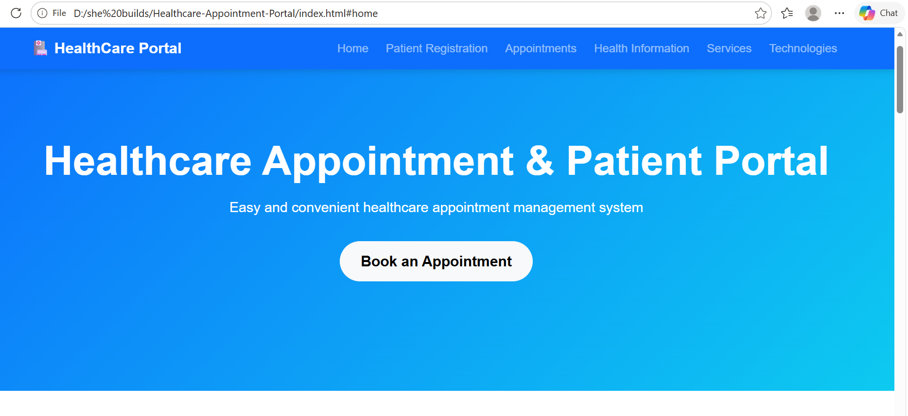
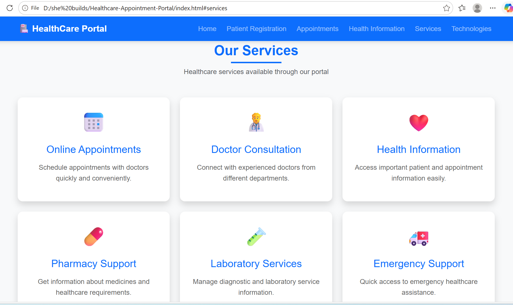
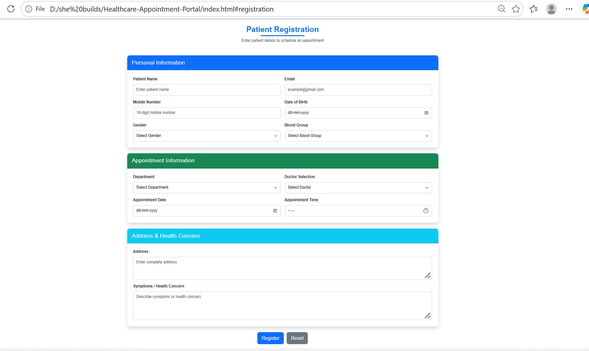
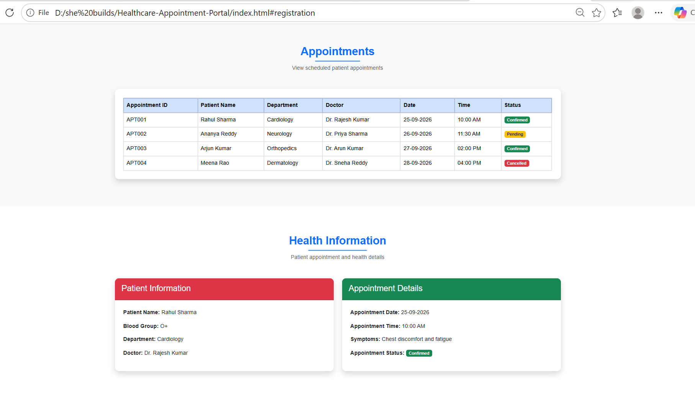

# 🏥 Healthcare Appointment & Patient Portal

A professional and responsive **Healthcare Appointment & Patient Portal** developed as a front-end academic mini project using **HTML5, CSS3, Bootstrap 5, and JavaScript**.

> **Note:** All patient names, appointment details, doctors, symptoms, and healthcare records displayed in this project are fictional sample/demo data created only for academic purposes.

---

## 📌 Project Overview

The **Healthcare Appointment & Patient Portal** is a web-based front-end application designed to provide a simple and user-friendly interface for healthcare-related activities.

The portal allows users to:

- View healthcare services
- Register patient details
- Select a healthcare department
- Select a doctor
- Enter appointment information
- View scheduled appointments
- View sample health information
- Validate registration forms
- Reset form information
- Navigate through different healthcare sections

---

## 🌐 Live Demo

🚀 **[View Live Demo](https://kukatireshmitha986-create.github.io/Healthcare-Appointment-Portal/)**

The project is deployed using GitHub Pages and can be accessed directly through the link above.

## 🎯 Project Objectives

- To develop a responsive healthcare web portal.
- To create a structured patient registration interface.
- To design an appointment management section.
- To display appointment information in a clear format.
- To display patient health information using organized cards.
- To implement JavaScript-based form validation.
- To demonstrate DOM manipulation and event handling.
- To understand the integration of HTML5, CSS3, Bootstrap 5, and JavaScript.
- To develop a professional and user-friendly healthcare interface.

---

## ✨ Features

### 🏠 Home Page

- Professional healthcare landing page
- Responsive navigation bar
- Healthcare portal introduction
- Appointment booking button
- Navigation to different sections
- Clean and modern user interface

### 👤 Patient Registration

The registration form collects:

- Patient Name
- Email
- Mobile Number
- Date of Birth
- Gender
- Blood Group
- Department
- Doctor Selection
- Appointment Date
- Appointment Time
- Address
- Symptoms / Health Concern

The form provides:

- Register button
- Reset button
- Input validation
- User-friendly layout

### 📅 Appointment Management

The appointment section displays:

- Appointment ID
- Patient Name
- Department
- Doctor
- Appointment Date
- Appointment Time
- Appointment Status

### 🩺 Health Information

The portal displays sample health information including:

- Patient Name
- Blood Group
- Department
- Doctor
- Appointment Date
- Appointment Time
- Symptoms
- Appointment Status

### 🏥 Healthcare Services

The portal provides information about:

1. Online Appointments
2. Doctor Consultation
3. Health Information
4. Pharmacy Support
5. Laboratory Services
6. Emergency Support

### 📱 Responsive Design

The project is designed to work across:

- Desktop computers
- Laptops
- Tablets
- Mobile devices

### ⚙️ JavaScript Functionality

JavaScript is used for:

- Form validation
- Event handling
- DOM manipulation
- User alerts
- Form reset
- Interactive functionality

---

## 🛠️ Technologies Used

| Technology | Purpose |
|---|---|
| HTML5 | Web page structure |
| CSS3 | Custom styling and layout |
| Bootstrap 5 | Responsive design and UI components |
| JavaScript | Validation and interactive functionality |
| Git | Version control |
| GitHub | Source code hosting |
| Visual Studio Code | Development environment |

---

## 📂 Project Structure

    Healthcare-Appointment-Portal/
    │
    ├── index.html
    ├── style.css
    ├── script.js
    ├── PROJECT-REPORT.docx
    │
    └── screenshots/
        ├── home.png
        ├── services.png
        ├── patient-registration.png
        └── appointments-health-information.png

---

## 📄 File Description

### `index.html`

Contains the main structure of the healthcare portal, including:

- Navigation bar
- Home section
- Patient registration form
- Appointment section
- Health information
- Healthcare services
- Technologies section

### `style.css`

Contains custom styling for:

- Colors
- Typography
- Sections
- Cards
- Buttons
- Forms
- Tables
- Responsive layout

### `script.js`

Contains JavaScript functionality for:

- Form validation
- Event handling
- Alerts
- DOM manipulation
- Form reset
- Interactive operations

### `PROJECT-REPORT.docx`

Contains the detailed academic project report.

---

## 🌐 Website Navigation

    Home
      ↓
    Patient Registration
      ↓
    Appointments
      ↓
    Health Information
      ↓
    Services
      ↓
    Technologies

---

# 🏠 Home Page

The Home page introduces the **Healthcare Appointment & Patient Portal**.

It includes:

- Healthcare Portal branding
- Navigation menu
- Project introduction
- Appointment booking button
- Responsive hero section

### Screenshot

---

# 🏥 Healthcare Services

The Services section provides information about healthcare services available through the portal.

### Available Services

#### 1. Online Appointments

Schedule appointments with doctors quickly and conveniently.

#### 2. Doctor Consultation

Connect with experienced doctors from different departments.

#### 3. Health Information

Access important patient and appointment information easily.

#### 4. Pharmacy Support

Get information about medicines and healthcare requirements.

#### 5. Laboratory Services

Manage diagnostic and laboratory service information.

#### 6. Emergency Support

Quick access to emergency healthcare assistance.

### Screenshot

---

# 👤 Patient Registration

The Patient Registration section allows users to enter patient and appointment information.

### Personal Information

- Patient Name
- Email
- Mobile Number
- Date of Birth
- Gender
- Blood Group

### Appointment Information

- Department
- Doctor Selection
- Appointment Date
- Appointment Time

### Address & Health Concern

- Address
- Symptoms / Health Concern

The form provides:

- **Register**
- **Reset**

buttons.

### Screenshot

---

# 📅 Appointment Management

The Appointments section displays scheduled patient appointments in a structured table.

### Appointment Fields

| Field | Description |
|---|---|
| Appointment ID | Unique appointment identifier |
| Patient Name | Name of the patient |
| Department | Selected medical department |
| Doctor | Assigned doctor |
| Date | Appointment date |
| Time | Appointment time |
| Status | Appointment status |

### Sample Appointment Data

| Appointment ID | Patient Name | Department | Doctor | Date | Time | Status |
|---|---|---|---|---|---|---|
| APT001 | Rahul Sharma | Cardiology | Dr. Rajesh Kumar | 25-09-2026 | 10:00 AM | Confirmed |
| APT002 | Ananya Reddy | Neurology | Dr. Priya Sharma | 26-09-2026 | 11:30 AM | Pending |
| APT003 | Arjun Kumar | Orthopedics | Dr. Arun Kumar | 27-09-2026 | 02:00 PM | Confirmed |
| APT004 | Meena Rao | Dermatology | Dr. Sneha Reddy | 28-09-2026 | 04:00 PM | Cancelled |

> **Important:** The above patient and appointment information is fictional sample data used only to demonstrate the interface.

---

# 🩺 Health Information

The Health Information section displays sample patient and appointment information using organized cards.

### Patient Information

- **Patient Name:** Rahul Sharma
- **Blood Group:** O+
- **Department:** Cardiology
- **Doctor:** Dr. Rajesh Kumar

### Appointment Details

- **Appointment Date:** 25-09-2026
- **Appointment Time:** 10:00 AM
- **Symptoms:** Chest discomfort and fatigue
- **Appointment Status:** Confirmed

> The information above is fictional demonstration data and does not represent a real patient.

### Screenshot

---

## 📱 Responsive Design

The portal uses **Bootstrap 5** and custom CSS to create a responsive interface.

The website adapts to different screen sizes including:

- Desktop
- Laptop
- Tablet
- Mobile

Bootstrap grid classes and responsive components are used to maintain a consistent layout.

---

## ⚙️ JavaScript Functionality

JavaScript provides interactive functionality to the portal.

The application demonstrates:

    User Input
        ↓
    JavaScript Validation
        ↓
    Event Handling
        ↓
    DOM Manipulation
        ↓
    User Feedback

JavaScript is used for:

- Form validation
- DOM manipulation
- Button events
- Alerts
- Form reset
- Interactive elements

---

## ✅ Form Validation

The patient registration form performs validation before processing user input.

Validation helps ensure that required information is entered correctly.

The project demonstrates validation for:

- Patient details
- Email
- Mobile number
- Appointment information
- Health concern

---

## 🧪 Testing

The application was tested for the following functionality:

| Test Case | Expected Result | Status |
|---|---|---|
| Open Home Page | Home page loads successfully | ✅ Passed |
| Navigate to Services | Services section displayed | ✅ Passed |
| Open Registration | Registration form displayed | ✅ Passed |
| Enter Patient Details | Form accepts valid input | ✅ Passed |
| Submit Invalid/Empty Form | Validation is triggered | ✅ Passed |
| Reset Form | Form fields are cleared | ✅ Passed |
| View Appointments | Appointment table displayed | ✅ Passed |
| View Health Information | Health information displayed | ✅ Passed |
| Responsive Layout | Layout adapts to screen size | ✅ Passed |

---

## ▶️ How to Run the Project

### Method 1: Open Directly

1. Download or clone the repository.
2. Open the project folder.
3. Double-click `index.html`.
4. The website will open in your default browser.

### Method 2: Using Visual Studio Code

1. Open **Visual Studio Code**.
2. Select **File → Open Folder**.
3. Select the project folder.
4. Open `index.html`.
5. Right-click `index.html`.
6. Select **Open with Live Server**.

The healthcare portal will open in your browser.

---

## 📥 Clone the Repository

    git clone https://github.com/kukatireshmitha986-create/Healthcare-Appointment-Portal.git
    cd Healthcare-Appointment-Portal

Open `index.html` in a browser or run it using Live Server.

---

## 🖥️ System Requirements

### Hardware

- Computer or Laptop
- Minimum 4 GB RAM recommended

### Software

- Windows / Linux / macOS
- Modern web browser
- Visual Studio Code
- Git

### Supported Browsers

- Google Chrome
- Microsoft Edge
- Mozilla Firefox
- Other modern browsers

---

## 🗄️ Database

This project does **not** use a database.

The current version is a front-end academic project and uses sample/static appointment and patient information.

Future versions can integrate a database for persistent data storage.

---

## 🔐 Data Privacy and Security

This project is created for academic demonstration purposes.

It does not contain:

- Real patient records
- Real medical information
- Real doctor accounts
- Real appointment bookings
- Real healthcare databases
- Production healthcare services

All patient and appointment information shown in the interface is fictional sample data.

---

## 🚧 Current Limitations

The current version is primarily a front-end implementation.

Limitations include:

- No backend server
- No database integration
- No real user authentication
- No real-time appointment availability
- No real doctor login
- No online payment system
- No email notifications
- No SMS notifications
- Appointment information is sample/static data
- No persistent patient record storage

---

## 🔮 Future Enhancements

The project can be enhanced with:

- Secure user authentication
- Patient login and profile management
- Doctor login and dashboard
- Admin dashboard
- Database integration
- Real-time appointment booking
- Email notifications
- SMS notifications
- Digital prescription management
- Laboratory report management
- Online payment integration
- Healthcare analytics dashboard
- Cloud deployment
- Advanced security and access control
- Progressive Web App support

---

## 🎓 Learning Outcomes

Through this project, the following concepts were practiced:

- HTML5 semantic structure
- CSS3 styling
- Bootstrap 5
- Responsive web design
- JavaScript programming
- DOM manipulation
- Form validation
- Event handling
- User interface design
- Navigation design
- Front-end project organization
- Git and GitHub
- Basic software testing

---

## 📚 Concepts Demonstrated

    HTML5
     │
     ├── Forms
     ├── Tables
     ├── Sections
     ├── Navigation
     └── Semantic Structure
           │
           ▼
    CSS3
     │
     ├── Styling
     ├── Layout
     ├── Cards
     ├── Buttons
     └── Responsive Design
           │
           ▼
    Bootstrap 5
     │
     ├── Navbar
     ├── Grid System
     ├── Cards
     ├── Forms
     ├── Buttons
     └── Responsive Components
           │
           ▼
    JavaScript
     │
     ├── Form Validation
     ├── DOM Manipulation
     ├── Event Handling
     ├── Alerts
     └── User Interaction

---

# 📸 Screenshots

## 🏠 Home Page

## 🏥 Healthcare Services

## 👤 Patient Registration

## 📅 Appointments & Health Information

---

## 📊 Project Information

| Category | Details |
|---|---|
| **Project Title** | Healthcare Appointment & Patient Portal |
| **Project Type** | Front-End Mini Project |
| **Domain** | Healthcare / Web Development |
| **Frontend** | HTML5, CSS3, Bootstrap 5 |
| **Scripting** | JavaScript |
| **Backend** | Not Used |
| **Database** | Not Used |
| **Development Tool** | Visual Studio Code |
| **Version Control** | Git |
| **Repository** | GitHub |
| **Student** | Reshmitha Kukati |
| **Department** | Artificial Intelligence and Data Science |
| **Year** | III Year |
| **Institution** | Prathyusha Engineering College |

---

## 👩‍💻 Author

**Reshmitha Kukati**

B.Tech Artificial Intelligence and Data Science

Prathyusha Engineering College

---

## 🔗 GitHub Repository

https://github.com/kukatireshmitha986-create/Healthcare-Appointment-Portal

---

## ⭐ Conclusion

The **Healthcare Appointment & Patient Portal** demonstrates how **HTML5, CSS3, Bootstrap 5, and JavaScript** can be combined to create a responsive and interactive healthcare web application.

The project provides a structured interface for patient registration, appointment information, health information, and healthcare services.

It also demonstrates important front-end development concepts including responsive design, form validation, DOM manipulation, event handling, and user interaction.

The project serves as an academic demonstration of front-end web development and provides a foundation for future development of a complete healthcare management system with backend services, database integration, authentication, and cloud deployment.

---

## ⭐ Project Highlights

    🏥 Healthcare Appointment & Patient Portal
    │
    ├── 🏠 Responsive Home Page
    ├── 👤 Patient Registration
    ├── 📅 Appointment Management
    ├── 🩺 Health Information
    ├── 🏥 Healthcare Services
    ├── ⚙️ JavaScript Validation
    ├── 📱 Responsive Design
    ├── 🎨 Bootstrap 5 UI
    └── 📚 Academic Mini Project

---

## 📌 Project Summary

**Healthcare Appointment & Patient Portal** is a responsive front-end academic project that demonstrates the practical integration of **HTML5, CSS3, Bootstrap 5, and JavaScript** to build a structured healthcare web interface.

The project focuses on patient registration, appointment management, healthcare services, health information presentation, responsive design, and client-side validation.

**Developed by:** Reshmitha Kukati  
**Department:** Artificial Intelligence and Data Science  
**Institution:** Prathyusha Engineering College  
**Project Type:** Academic Mini Project
